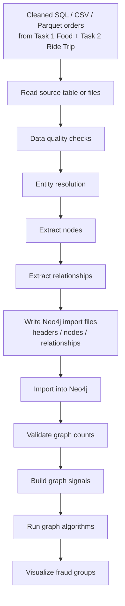

# Task 3 SQL/CSV/Parquet To Neo4j Import

## Purpose

Task 1 Food and Task 2 Ride Trip may hand off cleaned order-level tables such as:

```text
orders_food_clean_dashboard.sql
orders_food_clean_dashboard.csv
orders_food_clean_dashboard.parquet
orders_ride_clean_dashboard.sql
orders_ride_clean_dashboard.csv
orders_ride_clean_dashboard.parquet
```

In that case, Task 3 must convert these SQL tables or tabular files into a
Graph Database in Neo4j. This step turns each order row into graph entities and
relationships so that Cypher queries and graph algorithms can detect suspicious
connected groups.

## Import Flow



## Input Type

This input is a cleaned order table, not graph-ready data yet.

| Input format | Meaning | Task 3 responsibility |
|---|---|---|
| `SQL table/query` | Cleaned order table stored in a relational database. | Read directly from SQL source, validate, and split into graph nodes and relationships. |
| `.csv` | Cleaned order table in row/column format. | Read, validate, split into nodes and relationships. |
| `.parquet` | Same logical data as CSV but more efficient for large files. | Prefer this for large data because it is faster and smaller. |
| `headers/nodes/relationships` | Already graph-ready Neo4j import data. | Validate and import directly. |

## Current Importer Support

The current importer supports:

- file source via `--source` for `.csv` and `.parquet`
- SQL source via `--sql-uri` with either `--sql-query` or `--sql-table`

Example:

```powershell
.\.venv\Scripts\python.exe -m scripts.prepare_clean_orders_neo4j_import `
  --sql-uri sqlite:///D:/VSF/tmp_sql_smoke/food_smoke.db `
  --sql-table orders_food_clean `
  --domain food `
  --output data\\neo4j-import\\neo4j-import-output `
  --overwrite
```

## Node Mapping

From each cleaned Food/Ride order row, Task 3 should create or update these
nodes.

| Source columns | Neo4j node | Key property | Notes |
|---|---|---|---|
| `customer_id` | `Customer` | `customer_id` | Shared across Food and Ride if IDs are consistent. |
| `order_id` | `Order` | `order_id` | Add `domain = food` or `domain = ride`. |
| `driver_id` | `Driver` | `driver_id` | Used by Ride and sometimes Food delivery. |
| `merchant_id` | `Merchant` | `merchant_id` | Food-specific entity. |
| `pickup_address`, `pickup_district_name`, `pickup_province_name` | `Address` | `address_key` | Normalize text before hashing key. |
| `last_dropoff_address`, `last_dropoff_district_name`, `last_dropoff_province_name` | `Address` | `address_key` | Same Address label as pickup. |
| `payment_method` | `PaymentMethod` | `name` | Shared signal across domains. |
| `promotion_code` | `PromotionCode` | `code` | Shared signal across domains. |
| `promotion_campaign_code` | `PromotionCampaign` | `code` | Optional campaign-level grouping. |
| `rule_name` if provided | `Rule` | `name` | Comes from Task 1/2 flagged-order output. |
| `model_name`, `model_version` if provided | `ModelScore` or order property | `score_key` | Used for anomaly score comparison. |

## Relationship Mapping

| Relationship | From | To | Source columns |
|---|---|---|---|
| `PLACED` | `Customer` | `Order` | `customer_id`, `order_id` |
| `SERVED` | `Driver` | `Order` | `driver_id`, `order_id` |
| `FROM_MERCHANT` | `Order` | `Merchant` | `order_id`, `merchant_id` |
| `PICKUP_AT` | `Order` | `Address` | `order_id`, pickup address fields |
| `DROPOFF_AT` | `Order` | `Address` | `order_id`, dropoff address fields |
| `PAID_BY` | `Order` | `PaymentMethod` | `order_id`, `payment_method` |
| `USED_PROMO` | `Order` | `PromotionCode` | `order_id`, `promotion_code` |
| `IN_CAMPAIGN` | `PromotionCode` | `PromotionCampaign` | `promotion_code`, `promotion_campaign_code` |
| `FLAGGED_BY` | `Order` | `Rule` | `order_id`, `rule_name`, `rule_score`, `flag_reason` |
| `SCORED_BY` | `Order` | `ModelScore` | `order_id`, `anomaly_score`, `model_version` |

## Important Order Properties

The `Order` node should keep the most useful properties for dashboard, scoring,
and investigation.

```text
domain
status / order_status
order_time
order_date
order_hour
service_name
travel_mode
is_completed
is_cancelled
gmv
discount
commission
net_income
food_total_paid
food_total_item_quantity
declared_km
actual_km
km_ratio
avg_kmh
lead_time_second
has_promotion
has_dropoff_fail
anomaly_score
```

## Data Quality Checks

Before importing into Neo4j, Task 3 should check:

| Check | Why |
|---|---|
| Missing `order_id` | Cannot create a stable `Order` node. |
| Missing `customer_id` | Cannot connect order to customer behavior. |
| Duplicate `domain + order_id` | Can create duplicated order nodes or wrong relationships. |
| Invalid `order_time` | Breaks daily dashboard and time-window graph runs. |
| Empty shared signals | Null promo/payment/address should not create noisy nodes. |
| Invalid numeric fields | Affects anomaly score, risk score, and impact score. |
| Rule fields missing | Cannot explain why an order was flagged. |
| Anomaly score missing | Cannot compare model with rule pseudo-label. |


## Position In Task 3

This import step sits before the graph algorithm pipeline:

```text
Input from Food + Ride SQL/CSV/Parquet
        |
Entity resolution + Data quality checks
        |
Build heterogeneous fraud graph in Neo4j
        |
Generate graph signals
        |
Degree / frequency analysis
        |
Weighted Node Similarity
        |
WCC + k-core + Louvain
        |
FraudCase classification
        |
Dashboard + visualization
```

## Expected Result

After this step, Neo4j should contain a connected graph like:

```text
(Customer)-[:PLACED]->(Order)-[:FROM_MERCHANT]->(Merchant)
(Driver)-[:SERVED]->(Order)
(Order)-[:PICKUP_AT]->(Address)
(Order)-[:DROPOFF_AT]->(Address)
(Order)-[:PAID_BY]->(PaymentMethod)
(Order)-[:USED_PROMO]->(PromotionCode)-[:IN_CAMPAIGN]->(PromotionCampaign)
(Order)-[:FLAGGED_BY]->(Rule)
(Order)-[:SCORED_BY]->(ModelScore)
```

This graph becomes the foundation for fraud-group detection and visualization.


## Implementation Notes

Current implementation:

- importer script: `scripts/prepare_clean_orders_neo4j_import.py`
- SQL support verified on Tuesday, July 21, 2026 with a direct SQLite smoke run
- SQL smoke manifest example: `tmp_sql_smoke/neo4j-import-sql/manifest.json`

This means Task 3 now supports `SQL -> Neo4j`, `CSV -> Neo4j`, and
`Parquet -> Neo4j` within the same import pipeline.

